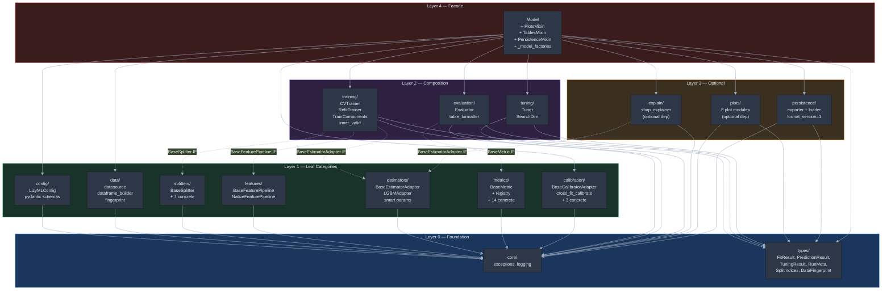
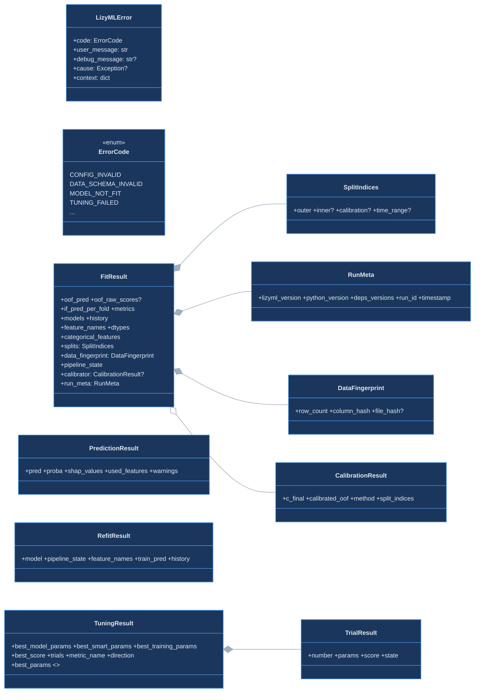
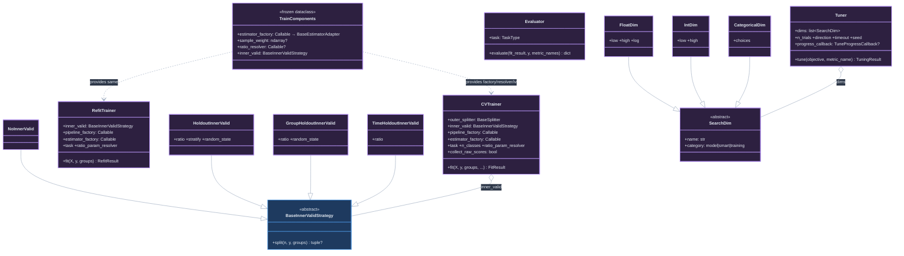
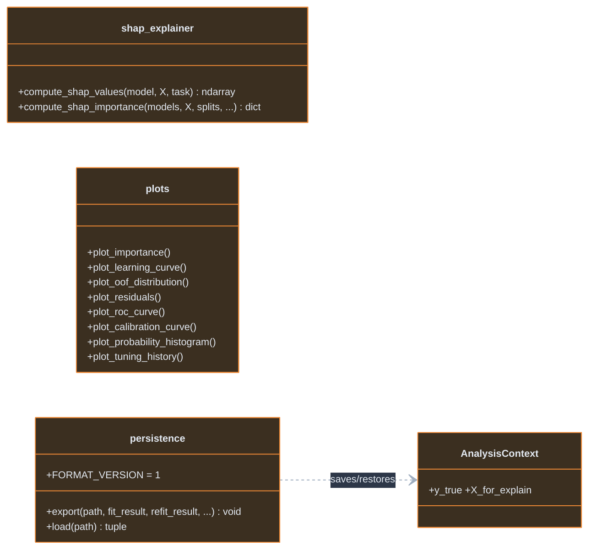
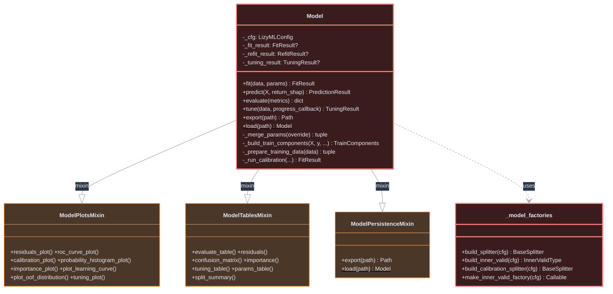

# Architecture

LizyML のアーキテクチャは **5 層のカテゴリ（圏）** で構成される。
各カテゴリは明確な境界を持ち、依存は常に上位層→下位層の DAG（非巡回有向グラフ）のみ。

## Layer Map — カテゴリ依存 DAG



### 依存ルール

| ルール | 説明 |
|---|---|
| **下方向のみ** | 各カテゴリは自分より上の Layer にのみ依存する |
| **IF 経由** | Layer 2 は Layer 1 の**抽象 IF のみ**を参照（具象クラスを import しない） |
| **Facade 独占** | 具象クラスの組み立て・型ディスパッチは Layer 4 のみが行う |
| **循環禁止** | カテゴリ間の双方向依存は許可しない |

### 射（カテゴリ間契約）

| From | To | 契約 |
|---|---|---|
| Config → Facade | `LizyMLConfig` (validated dict) |
| Data → Facade | `DataFrameComponents(X, y, time_col?, group_col?)` |
| Splitters → Training | `BaseSplitter.split(n, y, groups) → Iterator[(train_idx, valid_idx)]` |
| Features → Training | `BaseFeaturePipeline.fit(X, y)`, `.transform(X) → DataFrame` |
| Estimators → Training | `BaseEstimatorAdapter.fit()`, `.predict()`, `.predict_proba() → ndarray` |
| Metrics → Evaluation | `BaseMetric.__call__(y_true, y_pred) → float` |
| Calibration → Facade | `BaseCalibratorAdapter.fit(scores, y)`, `.predict(scores) → ndarray` |
| Training → Facade | `FitResult`, `RefitResult` |
| Evaluation → Facade | `dict` (structured metrics) |
| Tuning → Facade | `TuningResult` |

---

## Layer 0 — Foundation

依存ゼロ。全カテゴリが参照する共通基盤。



---

## Layer 1 — Leaf Categories

Foundation のみに依存。互いに依存しない。

### config/

```mermaid
%%{init: {'theme': 'base', 'themeVariables': {'fontSize': '11px', 'primaryColor': '#2d3748', 'primaryTextColor': '#e2e8f0', 'lineColor': '#a0aec0', 'background': '#1a202c', 'mainBkg': '#2d3748', 'nodeBorder': '#718096'}}}%%
classDiagram
    direction TB

    class LizyMLConfig:::configClass {
        +config_version: int
        +task: TaskType
        +data: DataConfig
        +features: FeaturesConfig
        +split: SplitConfig
        +model: ModelConfig
        +training: TrainingConfig
        +tuning: TuningConfig?
        +evaluation: EvaluationConfig
        +calibration: CalibrationConfig?
        +output_dir: str?
    }
    class DataConfig:::configClass { +path +target +time_col +group_col }
    class FeaturesConfig:::configClass { +exclude +auto_categorical +categorical }
    class TrainingConfig:::configClass { +seed +early_stopping: EarlyStoppingConfig }
    class EarlyStoppingConfig:::configClass { +enabled +rounds +inner_valid +validation_ratio }
    class EvaluationConfig:::configClass { +metrics: list }
    class CalibrationConfig:::configClass { +method +n_splits +params }
    class TuningConfig:::configClass { +optuna: OptunaConfig }

    LizyMLConfig *-- DataConfig
    LizyMLConfig *-- FeaturesConfig
    LizyMLConfig *-- TrainingConfig
    LizyMLConfig *-- EvaluationConfig
    LizyMLConfig *-- CalibrationConfig
    LizyMLConfig *-- TuningConfig
    TrainingConfig *-- EarlyStoppingConfig

    %% SplitConfig — discriminated union on "method"
    class KFoldConfig:::configClass { +method="kfold" }
    class StratifiedKFoldConfig:::configClass { +method="stratified_kfold" }
    class GroupKFoldConfig:::configClass { +method="group_kfold" }
    class TimeSeriesConfig:::configClass { +method="time_series" }
    class PurgedTimeSeriesConfig:::configClass { +method="purged_time_series" }
    class GroupTimeSeriesConfig:::configClass { +method="group_time_series" }

    LizyMLConfig *-- KFoldConfig : split
    LizyMLConfig *-- StratifiedKFoldConfig : split
    LizyMLConfig *-- GroupKFoldConfig : split
    LizyMLConfig *-- TimeSeriesConfig : split
    LizyMLConfig *-- PurgedTimeSeriesConfig : split
    LizyMLConfig *-- GroupTimeSeriesConfig : split

    %% ModelConfig — discriminated union on "name"
    class LGBMConfig:::configClass {
        +name="lgbm"
        +params: dict
        +auto_num_leaves +num_leaves_ratio
        +min_data_in_leaf_ratio +min_data_in_bin_ratio
        +feature_weights +balanced
    }
    LizyMLConfig *-- LGBMConfig : model

    %% InnerValidConfig — discriminated union on "method"
    class HoldoutInnerValidConfig:::configClass { +method="holdout" +ratio +stratify }
    class GroupHoldoutInnerValidConfig:::configClass { +method="group_holdout" +ratio }
    class TimeHoldoutInnerValidConfig:::configClass { +method="time_holdout" +ratio }
    EarlyStoppingConfig *-- HoldoutInnerValidConfig : inner_valid
    EarlyStoppingConfig *-- GroupHoldoutInnerValidConfig : inner_valid
    EarlyStoppingConfig *-- TimeHoldoutInnerValidConfig : inner_valid

    classDef configClass fill:#22543d,stroke:#68d391,color:#e2e8f0
```



### splitters/ + features/ + estimators/ + metrics/ + calibration/ + data/

```mermaid
%%{init: {'theme': 'base', 'themeVariables': {'fontSize': '11px', 'primaryColor': '#2d3748', 'primaryTextColor': '#e2e8f0', 'lineColor': '#a0aec0', 'background': '#1a202c', 'mainBkg': '#2d3748', 'nodeBorder': '#718096'}}}%%
classDiagram
    direction TB

    %% === splitters/ ===
    class BaseSplitter:::ifClass {
        <<abstract>>
        +split(n, y, groups) Iterator
    }
    class KFoldSplitter:::leafClass { }
    class StratifiedKFoldSplitter:::leafClass { }
    class GroupKFoldSplitter:::leafClass { }
    class TimeSeriesSplitter:::leafClass { }
    class PurgedTimeSeriesSplitter:::leafClass { }
    class GroupTimeSeriesSplitter:::leafClass { }
    KFoldSplitter --|> BaseSplitter
    StratifiedKFoldSplitter --|> BaseSplitter
    GroupKFoldSplitter --|> BaseSplitter
    TimeSeriesSplitter --|> BaseSplitter
    PurgedTimeSeriesSplitter --|> BaseSplitter
    GroupTimeSeriesSplitter --|> BaseSplitter

    %% === features/ ===
    class BaseFeaturePipeline:::ifClass {
        <<abstract>>
        +fit(X, y) +transform(X)
        +transform_with_warnings(X)
        +get_state() +load_state()
    }
    class NativeFeaturePipeline:::leafClass { }
    NativeFeaturePipeline --|> BaseFeaturePipeline

    %% === estimators/ ===
    class BaseEstimatorAdapter:::ifClass {
        <<abstract>>
        +fit() +predict() +predict_proba()
        +predict_raw() +importance()
        +update_params() +get_native_model()
        +best_iteration +eval_results
    }
    class LGBMAdapter:::leafClass {
        -_model: Booster
        +task +params +early_stopping_rounds
    }
    LGBMAdapter --|> BaseEstimatorAdapter

    %% === metrics/ ===
    class BaseMetric:::ifClass {
        <<abstract>>
        +name +needs_proba +needs_simplex
        +__call__(y_true, y_pred) float
    }
    class MetricRegistry:::leafClass {
        +get(name) BaseMetric
        +get_metrics_for_task(names, task) list
    }
    MetricRegistry ..> BaseMetric : lookups

    %% === calibration/ ===
    class BaseCalibratorAdapter:::ifClass {
        <<abstract>>
        +name: str
        +fit(scores, y) +predict(scores)
    }
    class PlattCalibrator:::leafClass { }
    class IsotonicCalibrator:::leafClass { }
    class BetaCalibrator:::leafClass { }
    PlattCalibrator --|> BaseCalibratorAdapter
    IsotonicCalibrator --|> BaseCalibratorAdapter
    BetaCalibrator --|> BaseCalibratorAdapter

    class cross_fit_calibrate:::leafClass {
        +cross_fit_calibrate(oof_scores, y, factory, splits) CalibrationResult
    }
    cross_fit_calibrate ..> BaseCalibratorAdapter : uses via factory

    %% === data/ ===
    class datasource:::leafClass {
        +read(path) DataFrame
    }
    class dataframe_builder:::leafClass {
        +build(df, problem_spec, feature_spec) DataFrameComponents
    }
    class DataFrameComponents:::leafClass { +X +y +time_col? +group_col? }
    dataframe_builder ..> DataFrameComponents : produces

    classDef ifClass fill:#1e3a5f,stroke:#4a90d9,color:#e2e8f0
    classDef leafClass fill:#22543d,stroke:#68d391,color:#e2e8f0
```



---

## Layer 2 — Composition

Layer 1 の **抽象 IF のみ** を参照。具象クラスを知らない。



**training/ が参照するのは IF のみ:**
- `BaseSplitter` (splitters/)、`BaseFeaturePipeline` (features/)、`BaseEstimatorAdapter` (estimators/)
- 具象クラス (`KFoldSplitter`, `LGBMAdapter` 等) を import しない

---

## Layer 3 — Optional



**依存先**: Foundation の型 (`FitResult`, `TuningResult` 等) のみ。Layer 1/2 の具象を直接参照しない。

---

## Layer 4 — Facade

**唯一**全カテゴリを知る層。具象クラスの組み立てとディスパッチを担当。



**Facade の責務**: Config を読み、各カテゴリの具象クラスを選択・組み立て・接続する。
ロジック（OOF 生成、metric 計算、学習ループ等）は一切持たない。

---

## 処理フロー

### fit()

```
Facade (Model)
  │
  ├─ 1. Data ── datasource.read → dataframe_builder.build
  │              → (X, y, groups)
  │
  ├─ 2. Config ── _merge_params(override)
  │              Config defaults < tune best < fit() args
  │              → (model_params, smart_params)
  │
  ├─ 3. Estimators ── resolve_smart_params(dict) → resolved params
  │    Config ── _model_factories.build_inner_valid(cfg)
  │              → TrainComponents (frozen dataclass)
  │
  ├─ 4. Training ── CVTrainer.fit(X, y, groups, ...)
  │    ┌─ Splitters ── outer_splitter.split() → indices
  │    ├─ per fold:
  │    │   ├─ Features ── pipeline.fit(X_train) → transform
  │    │   ├─ Estimators ── estimator.fit(X, y, X_valid, y_valid)
  │    │   └─ predictions → OOF / IF
  │    └─ → FitResult (metrics={})
  │
  ├─ 5. Calibration ── cross_fit_calibrate(oof_scores, y)
  │              → FitResult + CalibrationResult
  │
  ├─ 6. Evaluation ── Evaluator.evaluate(fit_result, y, metric_names)
  │    └─ Metrics ── registry → BaseMetric.__call__()
  │              → structured metrics dict
  │
  └─ 7. Training ── RefitTrainer.fit(X, y, groups)
                 → RefitResult (final model for inference)
```

### tune()

```
Facade (Model)
  │
  ├─ 1. Data ── _prepare_training_data
  │
  ├─ 2. Config ── _merge_params → base params
  │
  ├─ 3. Tuning ── parse_space or default_space
  │              → list[SearchDim], fixed params
  │
  ├─ 4. Facade builds objective closure:
  │    objective(trial):
  │      ├─ Tuning ── suggest_params → split_by_category
  │      ├─ Estimators ── resolve_smart_params
  │      ├─ Training ── CVTrainer.fit() → FitResult
  │      └─ Evaluation ── Evaluator → score
  │
  ├─ 5. Tuning ── Tuner.tune(objective)
  │              → TuningResult
  │
  └─ stored for next fit()
```

### predict()

```
Facade (Model)
  │
  ├─ 1. Features ── pipeline.load_state → transform_with_warnings
  │
  ├─ 2. Estimators ── model.predict / predict_proba
  │    └─ Calibration ── c_final.predict (binary)
  │
  ├─ 3. Explain ── compute_shap_values (optional)
  │
  └─ → PredictionResult
```

### export() / load()

```
export:  FitResult + RefitResult + Config + AnalysisContext
         → metadata.json + fit_result.pkl + refit_model.pkl
         format_version=1

load:    metadata.json → validate format_version
         → Model instance (predict / evaluate / plots ready)
```

---

## モジュール構成

```
lizyml/
│
├── core/                           ── Layer 0: Foundation ──
│   ├── exceptions.py               LizyMLError + ErrorCode
│   ├── logging.py                  logger + run_id + output_dir
│   ├── registries.py               MetricRegistry (generic)
│   └── types/
│       ├── fit_result.py           FitResult (13 fields)
│       ├── predict_result.py       PredictionResult
│       ├── tuning_result.py        TuningResult, TrialResult
│       └── artifacts.py            RunMeta, SplitIndices, DataFingerprint
│
├── config/                         ── Layer 1: Config ──
│   ├── schema.py                   pydantic schemas (extra="forbid")
│   └── loader.py                   YAML/JSON/dict → LizyMLConfig
│
├── data/                           ── Layer 1: Data ──
│   ├── datasource.py               CSV / Parquet / DataFrame
│   ├── dataframe_builder.py        X/y/groups 分離 + categorical
│   └── fingerprint.py              DataFingerprint 計算
│
├── splitters/                      ── Layer 1: Splitting ──
│   ├── base.py                     BaseSplitter
│   ├── kfold.py                    KFoldSplitter, StratifiedKFoldSplitter
│   ├── group_kfold.py              GroupKFoldSplitter
│   ├── time_series.py              TimeSeriesSplitter
│   ├── purged_time_series.py       PurgedTimeSeriesSplitter
│   └── group_time_series.py        GroupTimeSeriesSplitter
│
├── features/                       ── Layer 1: Features ──
│   ├── pipeline_base.py            BaseFeaturePipeline
│   ├── pipelines_native.py         NativeFeaturePipeline
│   └── encoders/                   CategoricalEncoder
│
├── estimators/                     ── Layer 1: Estimators ──
│   ├── base.py                     BaseEstimatorAdapter
│   └── lgbm.py                     LGBMAdapter + smart param resolution
│
├── metrics/                        ── Layer 1: Metrics ──
│   ├── base.py                     BaseMetric
│   ├── registry.py                 MetricRegistry helpers
│   ├── regression.py               RMSE, MAE, R2, RMSLE, MAPE, Huber
│   └── classification.py           LogLoss, AUC, AUCPR, F1, Accuracy, Brier, ECE
│
├── calibration/                    ── Layer 1: Calibration ──
│   ├── base.py                     BaseCalibratorAdapter
│   ├── cross_fit.py                cross_fit_calibrate + CalibrationResult
│   ├── registry.py                 get_calibrator
│   ├── platt.py                    PlattCalibrator
│   ├── isotonic.py                 IsotonicCalibrator
│   └── beta.py                     BetaCalibrator
│
├── training/                       ── Layer 2: Training ──
│   ├── cv_trainer.py               CVTrainer (outer CV loop)
│   ├── refit_trainer.py            RefitTrainer + RefitResult
│   ├── train_components.py         TrainComponents (frozen dataclass)
│   └── inner_valid.py              BaseInnerValidStrategy + 4 concrete
│
├── evaluation/                     ── Layer 2: Evaluation ──
│   ├── evaluator.py                Evaluator (structured metrics)
│   ├── table_formatter.py          evaluate_table 整形
│   └── confusion.py                confusion_matrix_table
│
├── tuning/                         ── Layer 2: Tuning ──
│   ├── tuner.py                    Tuner (Optuna study management)
│   └── search_space.py             SearchDim, parse/suggest/split_by_category
│
├── explain/                        ── Layer 3: Explain (optional) ──
│   └── shap_explainer.py           compute_shap_values / importance
│
├── plots/                          ── Layer 3: Plots (optional) ──
│   ├── importance.py               feature importance bar chart
│   ├── learning_curve.py           training/validation loss curve
│   ├── oof_distribution.py         OOF prediction distribution
│   ├── residuals.py                scatter/histogram/QQ
│   ├── classification.py           ROC curve
│   ├── calibration.py              reliability diagram + probability histogram
│   └── tuning.py                   tuning history plot
│
├── persistence/                    ── Layer 3: Persistence ──
│   ├── exporter.py                 export() + FORMAT_VERSION
│   └── loader.py                   load() + format_version validation
│
└── core/                           ── Layer 4: Facade ──
    ├── model.py                    Model (組み立てと委譲のみ)
    ├── _model_factories.py         splitter/inner_valid/calibration 構築
    ├── _model_plots.py             ModelPlotsMixin
    ├── _model_tables.py            ModelTablesMixin
    └── _model_persistence.py       ModelPersistenceMixin
```

---

## 凡例

| 色 | Layer | 意味 |
|---|---|---|
| 青 | 0 | **Foundation** — 全カテゴリが参照する型・例外・ログ |
| 緑 | 1 | **Leaf** — 互いに依存しない独立カテゴリ |
| 紫 | 2 | **Composition** — Layer 1 の IF を組み合わせるカテゴリ |
| 橙 | 3 | **Optional** — Foundation の型のみ参照する追加機能 |
| 赤 | 4 | **Facade** — 唯一全カテゴリを知り、組み立てる |

---

## 現状との差分（実装ロードマップ）

現在の実装はこの目標構造に概ね沿っているが、以下の修正が必要:

| # | 問題 | 目標 Layer ルール違反 | 修正方針 |
|---|---|---|---|
| 1 | `training/` が `evaluation/oof.py` に依存 | L2 → L2 (同層間の依存) | `oof.py` の `fill_oof`, `get_fold_pred` を `training/` に移動 |
| 2 | `evaluation/` が `calibration/` に依存 | L2 → L1 (逆方向ではないが不要) | calibrated metrics の組み立てを Facade に移動 |
| 3 | `estimators/` が `config/` に依存 | L1 → L1 (Leaf 間の依存) | `extract_smart_params(LGBMConfig)` を Facade に移動 |
| 4 | `types/` が `data/` に依存 | L0 → L1 (逆方向) | `DataFingerprint` を `types/` に移動 |
| 5 | `splitters/` ↔ `specs/` 循環 | 循環 | 死んだ Spec 層を削除 |
| 6 | デッドコード多数 | — | `TargetTransformer`, `SplitPlan`, 未使用 Spec 等を削除 |
