```mermaid
%%{init: {
  'theme': 'base',
  'themeVariables': {
    'fontSize': '12px',
    'primaryColor': '#2d3748',
    'primaryTextColor': '#e2e8f0',
    'primaryBorderColor': '#718096',
    'lineColor': '#a0aec0',
    'secondaryColor': '#1a202c',
    'tertiaryColor': '#2d3748',
    'background': '#1a202c',
    'mainBkg': '#2d3748',
    'nodeBorder': '#718096',
    'clusterBkg': '#2d374880',
    'clusterBorder': '#4a5568',
    'titleColor': '#e2e8f0',
    'edgeLabelBackground': '#2d3748',
    'textColor': '#e2e8f0',
    'labelTextColor': '#e2e8f0'
  }
}}%%
classDiagram
    direction TB

    %% ============================================================
    %% CONFIG LAYER — validation only, no logic
    %% ============================================================
    class LizyMLConfig {
        +config_version: int
        +task: TaskType
        +data: DataConfig
        +features: FeaturesConfig
        +split: SplitConfig
        +model: ModelConfig
        +training: TrainingConfig
        +tuning: TuningConfig?
        +evaluation: EvaluationConfig
        +calibration: CalibrationConfig?
        +output_dir: str?
    }
    class DataConfig { +path +target +time_col +group_col }
    class FeaturesConfig { +exclude +auto_categorical +categorical }
    class TrainingConfig { +seed +early_stopping: EarlyStoppingConfig }
    class EarlyStoppingConfig { +enabled +rounds +inner_valid +validation_ratio }
    class EvaluationConfig { +metrics: list }
    class CalibrationConfig { +method +n_splits +params }
    class TuningConfig { +optuna: OptunaConfig }

    LizyMLConfig *-- DataConfig
    LizyMLConfig *-- FeaturesConfig
    LizyMLConfig *-- TrainingConfig
    LizyMLConfig *-- EvaluationConfig
    LizyMLConfig *-- CalibrationConfig
    LizyMLConfig *-- TuningConfig
    TrainingConfig *-- EarlyStoppingConfig

    %% SplitConfig variants (discriminated union)
    class KFoldConfig { +method="kfold" }
    class StratifiedKFoldConfig { +method="stratified_kfold" }
    class GroupKFoldConfig { +method="group_kfold" }
    class TimeSeriesConfig { +method="time_series" }
    class PurgedTimeSeriesConfig { +method="purged_time_series" }
    class GroupTimeSeriesConfig { +method="group_time_series" }

    %% ModelConfig variants (discriminated union)
    class LGBMConfig {
        +name="lgbm"
        +params: dict
        +auto_num_leaves +num_leaves_ratio
        +min_data_in_leaf_ratio
        +min_data_in_bin_ratio
        +feature_weights +balanced
    }

    %% ============================================================
    %% ★ TrainComponents (H-0050)
    %% ============================================================
    class TrainComponents:::newClass {
        «dataclass»
        +estimator_factory: Callable → BaseEstimatorAdapter
        +sample_weight: ndarray?
        +ratio_resolver: Callable?
        +inner_valid: BaseInnerValidStrategy
    }

    %% ============================================================
    %% FACADE — Model
    %% ============================================================
    class Model:::facadeClass {
        -_cfg: LizyMLConfig
        -_fit_result: FitResult?
        -_refit_result: RefitResult?
        -_tuning_result: TuningResult?
        +fit(data, params) FitResult
        +predict(X) PredictionResult
        +evaluate(metrics) dict
        +tune(data) TuningResult
        +export(path)
        +load(path)$ Model
        -_build_train_components(X, y, model_params, smart_params) TrainComponents
        -_merge_params(override) tuple~dict, dict~
    }
    class ModelPlotsMixin:::mixinClass { +learning_curve_plot() +importance_plot() ... }
    class ModelTablesMixin:::mixinClass { +evaluate_table() +importance() ... }
    class ModelPersistenceMixin:::mixinClass { +export() +load()$ }

    Model --|> ModelPlotsMixin : mixin
    Model --|> ModelTablesMixin : mixin
    Model --|> ModelPersistenceMixin : mixin
    Model *-- LizyMLConfig
    Model *-- FitResult
    Model ..> TrainComponents : builds via _build_train_components

    %% ============================================================
    %% TRAINING LAYER
    %% ============================================================
    class CVTrainer {
        +outer_splitter: BaseSplitter
        +inner_valid: BaseInnerValidStrategy
        +pipeline_factory: Callable
        +estimator_factory: Callable
        +task: TaskType
        +fit(X, y, groups) FitResult
    }
    class RefitTrainer {
        +inner_valid: BaseInnerValidStrategy
        +pipeline_factory: Callable
        +estimator_factory: Callable
        +fit(X, y, groups) RefitResult
    }

    CVTrainer o-- BaseSplitter : outer_splitter
    CVTrainer o-- BaseInnerValidStrategy : inner_valid
    CVTrainer ..> BaseFeaturePipeline : creates via factory
    CVTrainer ..> BaseEstimatorAdapter : creates via factory
    CVTrainer ..> FitResult : produces
    RefitTrainer o-- BaseInnerValidStrategy
    RefitTrainer ..> RefitResult : produces

    TrainComponents ..> CVTrainer : provides factory/resolver/iv
    TrainComponents ..> RefitTrainer : provides same factory/resolver/iv

    %% ============================================================
    %% TUNING — Optuna study management only (H-0050)
    %% ============================================================
    class Tuner:::simplifiedClass {
        +dims: list~SearchDim~
        +n_trials +direction +timeout +seed
        +progress_callback: TuneProgressCallback?
        +tune(objective: Callable) TuningResult
    }
    Tuner ..> TuningResult : produces

    Model ..> Tuner : "builds objective, passes to Tuner"

    %% ============================================================
    %% ABSTRACTIONS
    %% ============================================================
    class BaseSplitter:::interfaceClass {
        «abstract»
        +split(n, y, groups) Iterator
    }
    class BaseEstimatorAdapter:::interfaceClass {
        «abstract»
        +fit() +predict() +predict_proba()
        +importance() +update_params()
    }
    class BaseFeaturePipeline:::interfaceClass {
        «abstract»
        +fit(X, y) +transform(X)
        +get_state() +load_state()
    }
    class BaseInnerValidStrategy:::interfaceClass {
        «abstract»
        +split(n, y, groups) tuple?
    }
    class BaseCalibratorAdapter:::interfaceClass {
        «abstract»
        +fit(scores, y) +predict(scores)
    }
    class BaseMetric:::interfaceClass {
        «abstract»
        +name +needs_proba
        +__call__(y_true, y_pred) float
    }

    %% ============================================================
    %% CONCRETE ESTIMATORS
    %% ============================================================
    class LGBMAdapter { -_model: Booster }
    LGBMAdapter --|> BaseEstimatorAdapter

    %% ============================================================
    %% CONCRETE SPLITTERS
    %% ============================================================
    class KFoldSplitter { }
    class StratifiedKFoldSplitter { }
    class GroupKFoldSplitter { }
    class TimeSeriesSplitter { }
    class PurgedTimeSeriesSplitter { }
    class GroupTimeSeriesSplitter { }
    class HoldoutSplitter { }
    KFoldSplitter --|> BaseSplitter
    StratifiedKFoldSplitter --|> BaseSplitter
    GroupKFoldSplitter --|> BaseSplitter
    TimeSeriesSplitter --|> BaseSplitter
    PurgedTimeSeriesSplitter --|> BaseSplitter
    GroupTimeSeriesSplitter --|> BaseSplitter
    HoldoutSplitter --|> BaseSplitter

    %% ============================================================
    %% CONCRETE PIPELINES, INNER VALID, CALIBRATORS
    %% ============================================================
    class NativeFeaturePipeline { }
    NativeFeaturePipeline --|> BaseFeaturePipeline

    class NoInnerValid { }
    class HoldoutInnerValid { }
    class GroupHoldoutInnerValid { }
    class TimeHoldoutInnerValid { }
    NoInnerValid --|> BaseInnerValidStrategy
    HoldoutInnerValid --|> BaseInnerValidStrategy
    GroupHoldoutInnerValid --|> BaseInnerValidStrategy
    TimeHoldoutInnerValid --|> BaseInnerValidStrategy

    class PlattCalibrator { }
    class IsotonicCalibrator { }
    class BetaCalibrator { }
    PlattCalibrator --|> BaseCalibratorAdapter
    IsotonicCalibrator --|> BaseCalibratorAdapter
    BetaCalibrator --|> BaseCalibratorAdapter

    %% ============================================================
    %% EVALUATION
    %% ============================================================
    class Evaluator {
        +task: TaskType
        +evaluate(fit_result, y, names) dict
    }
    Evaluator ..> BaseMetric : uses via registry

    %% ============================================================
    %% DATA TYPES (results)
    %% ============================================================
    class FitResult { +oof_pred +models +metrics +splits +calibrator +run_meta }
    class PredictionResult { +pred +proba +shap_values }
    class RefitResult { +model +pipeline_state +train_pred }
    class TuningResult:::newClass {
        +best_model_params: dict
        +best_smart_params: dict
        +best_training_params: dict
        +best_score: float
        +trials: list~TrialResult~
        +best_params: dict «property»
    }
    class CalibrationResult { +c_final +calibrated_oof }
    class SplitIndices { +outer +inner +calibration }

    FitResult *-- SplitIndices
    FitResult o-- CalibrationResult

    %% ============================================================
    %% SMART PARAM RESOLUTION (H-0050: unified)
    %% ============================================================
    class lgbm_smart:::factoryClass {
        +extract_smart_params(LGBMConfig) dict
        +resolve_smart_params(dict, ...) tuple
        +resolve_ratio_params(ratios, n) dict
    }
    lgbm_smart ..> LGBMConfig : reads
    Model ..> lgbm_smart : "_build_train_components calls"

    %% ============================================================
    %% FACTORY MODULE (splitter/inner_valid)
    %% ============================================================
    class _model_factories:::factoryClass {
        +build_splitter(cfg) BaseSplitter
        +build_inner_valid(cfg) InnerValidType
        +build_calibration_splitter(cfg) BaseSplitter
    }
    _model_factories ..> BaseSplitter : creates
    _model_factories ..> BaseInnerValidStrategy : creates
    Model ..> _model_factories : uses

    %% ============================================================
    %% DATA LAYER
    %% ============================================================
    class dataframe_builder:::factoryClass {
        +build(df, cfg) DataFrameComponents
    }
    Model ..> dataframe_builder : uses

    %% ============================================================
    %% PERSISTENCE & CALIBRATION
    %% ============================================================
    class persistence:::factoryClass { +export() +load() }
    class cross_fit_calibrate:::factoryClass { +cross_fit_calibrate() CalibrationResult }

    %% ============================================================
    %% FLOW ANNOTATIONS
    %% ============================================================
    note for Model "fit() の流れ (H-0050):\n1. _merge_params() → model_params, smart_params\n2. _build_train_components(X, y, ...) → TrainComponents\n3. CVTrainer(tc.estimator_factory, tc.ratio_resolver, ...)\n4. RefitTrainer(tc.estimator_factory, tc.ratio_resolver, ...)\n★ CV と Refit は同一の TrainComponents を共有"

    note for Tuner "tune() の流れ (H-0050):\nModel が objective クロージャを構築:\n  各 trial → _build_train_components()\n           → CVTrainer.fit() → score\nTuner は Optuna study 管理のみ。\nLGBM 固有 import なし。"

    note for TrainComponents "CVTrainer と RefitTrainer に\n同一インスタンスを渡すことで\nパラメータの一貫性を構造的に保証。\nfit() でも tune() の各 trial でも\n同じ _build_train_components() で構築。"

    %% ============================================================
    %% STYLES
    %% ============================================================
    classDef interfaceClass fill:#1e3a5f,stroke:#4a90d9,color:#e2e8f0
    classDef newClass fill:#22543d,stroke:#68d391,color:#e2e8f0,stroke-width:3px
    classDef simplifiedClass fill:#22543d,stroke:#68d391,color:#e2e8f0,stroke-width:2px
    classDef mixinClass fill:#4a3728,stroke:#ed8936,color:#e2e8f0
    classDef factoryClass fill:#3b2f63,stroke:#b794f4,color:#e2e8f0
    classDef facadeClass fill:#2d3748,stroke:#fc8181,color:#e2e8f0,stroke-width:3px
```

## 凡例

| スタイル | 意味 |
|---|---|
| 緑枠 | **H-0050 で新規/変更** — TrainComponents, TuningResult, Tuner |
| 青背景 | **Interface** — 変更なし |
| 赤枠 | **Model facade** — `_build_train_components` / `_merge_params` 追加 |
| 橙 | **Mixin** — 変更なし |
| 紫 | **Factory** — lgbm_smart (統一), _model_factories 等 |

## データフロー概要

### fit()

```
Config
  ├── _merge_params(override)
  │     Config defaults + tune best + fit引数
  │     → (model_params, smart_params)
  │
  └── _build_train_components(X, y, model_params, smart_params)
        ├── resolve_smart_params(dict, ...)   ← 統一関数
        ├── _build_ratio_resolver(smart)
        └── make_estimator closure
              → TrainComponents
                   │
                   ├── CVTrainer.fit()     → FitResult
                   └── RefitTrainer.fit()  → RefitResult
```

### tune()

```
Config
  ├── extract_smart_params(cfg.model) → smart_defaults
  │
  └── objective(trial):
        ├── split_by_category(trial_params) → model_p, smart_p, training_p
        ├── merge: {**smart_defaults, **smart_p}
        │
        └── _build_train_components(X, y, ...)  ← 同じ関数
              → TrainComponents
                   └── CVTrainer.fit() → score
```
